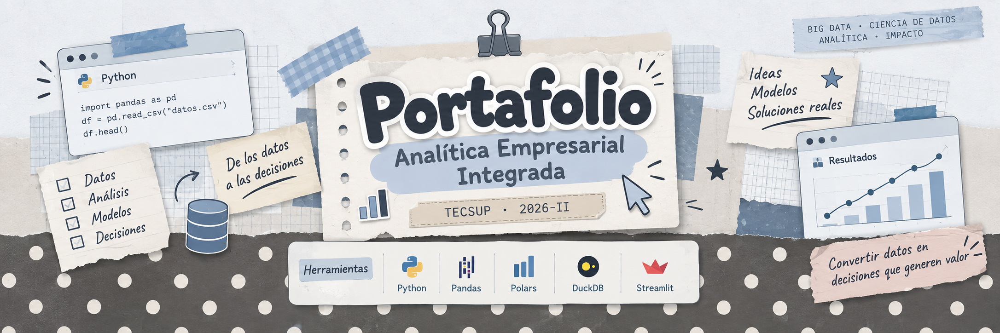

<div align="center">



</div>


<div align="center">

**TECSUP · 2026-II**

`BIG DATA Y CIENCIA DE DATOS` · `ANALÍTICA` · `DATOS` · `DECISIONES`

</div>

---

## ⋆ ˚｡⋆ Datos

| | |
|---|---|
| **Estudiante** | **Trilce Aranda** |
| **Carrera** | Big Data y Ciencia de Datos |
| **Institución** | TECSUP |
| **Curso** | Analítica Empresarial Integrada |
| **Periodo** | 2026-II |
| **Docente** | Pilar Rocío Sayán Mejía |

Este repositorio reúne el desarrollo académico realizado durante el curso **Analítica Empresarial Integrada**, desde el análisis de datos y construcción de métricas hasta la generación de modelos, evaluación de decisiones y desarrollo de productos analíticos.

---

## ୨୧ ¿Qué es Analítica Empresarial Integrada?

El curso desarrolla la capacidad de **convertir datos en decisiones empresariales defendibles**, integrando análisis, modelos y herramientas tecnológicas con problemas reales de negocio.

El recorrido considera no solo la construcción de soluciones analíticas, sino también la **interpretación de resultados, identificación de riesgos, comunicación de hallazgos y evaluación de alternativas**.

### El enfoque del curso

```text
DATOS
  ↓
MÉTRICAS
  ↓
ANÁLISIS
  ↓
MODELOS
  ↓
DECISIONES
  ↓
VALOR
```

La pregunta que acompaña este recorrido es:

> **¿Cómo convertir los datos en decisiones que generen valor medible?**

---

## ୨୧ La escalera analítica

El curso trabaja cuatro niveles de analítica, cada uno asociado a una pregunta diferente.

| Nivel | Pregunta | Propósito |
|---|---|---|
| 📊 **Descriptiva** | ¿Qué pasó? | Comprender los resultados observados |
| 🔍 **Diagnóstica** | ¿Por qué pasó? | Identificar factores relacionados con el cambio |
| 🔮 **Predictiva** | ¿Qué podría pasar? | Anticipar escenarios futuros |
| ⚙️ **Prescriptiva** | ¿Qué conviene hacer? | Evaluar alternativas y apoyar decisiones |

> **Describir → explicar → anticipar → decidir**

---

# ୨୧ Recorrido del curso

## 01 · El valor del dato y la métrica de negocio

**Semanas 01–04**

<details>
<summary><strong>Semana 01 · La empresa analítica en la era de la IA</strong></summary>

- Datos e información como activos estratégicos.
- Empresa analítica en la era de la IA.
- Escalera analítica.
- Diferencia entre almacenar datos y utilizarlos estratégicamente.
- Causas de fallas en iniciativas analíticas.
- Diagnóstico del uso de analítica en una empresa.

**Aplicación:** diagnóstico de madurez y uso de analítica.

</details>

<details>
<summary><strong>Semana 02 · Competencia analítica y madurez organizacional</strong></summary>

- Evolución de la capacidad analítica.
- Modelo DELTA.
- Competidor analítico.
- Madurez organizacional.
- Impacto de la IA generativa.
- Comparación de perfiles mediante datos.

**Aplicación:** análisis comparativo utilizando Polars y DuckDB.

</details>

<details>
<summary><strong>Semana 03 · La métrica que importa</strong></summary>

- Árbol de métricas.
- North Star Metric.
- KPIs accionables.
- Vanity metrics.
- Adquisición.
- Retención.
- Margen.
- Eficiencia.

**Aplicación:** construcción de un árbol de métricas y visualización con Plotly.

</details>

<details>
<summary><strong>Semana 04 · Analítica diagnóstica</strong></summary>

- Descomposición de variaciones.
- Precio, volumen y mix.
- Cohortes.
- Retención.
- Segmentación explicativa.
- Identificación del principal factor asociado a un cambio.

**Aplicación:** diagnóstico de variaciones de resultados.

</details>

---

## 02 · Decisión, experimentación y causalidad

**Semanas 05–08**

<details>
<summary><strong>Semana 05 · Decidir bajo incertidumbre</strong></summary>

- Intervalos de confianza.
- Tamaño del efecto.
- Riesgo.
- Valor esperado.
- Costo de una decisión incorrecta.
- Simulación Monte Carlo.

**Aplicación:** evaluación de decisiones bajo escenarios inciertos.

</details>

<details>
<summary><strong>Semana 06 · Experimentación empresarial</strong></summary>

- Pruebas A/B.
- Hipótesis.
- Potencia estadística.
- Tamaño de muestra.
- Errores tipo I y II.
- Métrica principal.
- Métricas de protección.

**Aplicación:** diseño y evaluación de un experimento empresarial.

</details>

<details>
<summary><strong>Semana 07 · Causalidad</strong></summary>

- Correlación y causalidad.
- Variables de confusión.
- Sesgo de selección.
- Paradoja de Simpson.
- Diagramas causales.
- Difference-in-Differences.
- Synthetic Control.

**Aplicación:** evaluación causal de una intervención.

</details>

<details>
<summary><strong>Semana 08 · Evaluación del Bloque I</strong></summary>

Integración de los contenidos desarrollados durante las semanas 01–07.

- Evaluación individual.
- Informe analítico.
- Notebook reproducible.
- Demostración del trabajo.

</details>

---

## 03 · Analítica predictiva y prescriptiva

**Semanas 09–12**

<details>
<summary><strong>Semana 09 · Analítica de clientes</strong></summary>

- Propensity.
- Churn.
- Customer Lifetime Value.
- RFM.
- Umbrales de decisión.
- Evaluación económica de modelos.

**Aplicación:** modelo de churn orientado al valor económico.

</details>

<details>
<summary><strong>Semana 10 · Pronóstico de demanda</strong></summary>

- Tendencia.
- Estacionalidad.
- Ciclos.
- Cambios de régimen.
- Modelos base.
- Validación temporal.
- Backtesting.
- Error desde una perspectiva de negocio.

**Aplicación:** pronóstico comparado con un baseline.

</details>

<details>
<summary><strong>Semana 11 · Analítica prescriptiva y optimización</strong></summary>

- Programación lineal.
- Programación entera.
- Función objetivo.
- Restricciones.
- Inventarios.
- Turnos.
- Rutas.
- Asignación de recursos.

**Aplicación:** modelo de optimización con PuLP.

</details>

<details>
<summary><strong>Semana 12 · Analítica de procesos internos</strong></summary>

- Finanzas.
- Operaciones.
- Calidad.
- I+D.
- Detección de anomalías.
- Fraude.
- Gráficos de control.
- Productividad.
- Rotación.

**Aplicación:** detección de anomalías y análisis de procesos.

</details>

---

## 04 · Gobierno, IA generativa y producto de datos

**Semanas 13–16**

<details>
<summary><strong>Semana 13 · Gobierno y cumplimiento normativo</strong></summary>

- DAMA-DMBOK.
- Data contracts.
- Data lineage.
- Catálogo de datos.
- Sesgo y fairness.
- Explicabilidad.
- SHAP.
- Cumplimiento normativo.
- Regulación de IA.

**Aplicación:** auditoría de modelos y evaluación de riesgos.

</details>

<details>
<summary><strong>Semana 14 · IA generativa en analítica empresarial</strong></summary>

- LLM como componente analítico.
- Text-to-SQL.
- RAG.
- Agentes.
- Alucinaciones.
- Evaluación de respuestas.
- Casos en los que no conviene utilizar IA.

**Aplicación:** prototipo de asistente analítico y evaluación.

</details>

<details>
<summary><strong>Semana 15 · Comunicación ejecutiva y producto de datos</strong></summary>

- Storytelling con datos.
- Informe ejecutivo.
- Pitch.
- Roadmap analítico.
- Despliegue.
- Streamlit.

**Aplicación:** desarrollo y presentación de un producto analítico.

</details>

<details>
<summary><strong>Semana 16 · Evaluación del Bloque II</strong></summary>

Integración de los contenidos desarrollados durante las semanas 09–15.

- Evaluación individual.
- Pitch ejecutivo.
- Demostración del producto.
- Informe final.

</details>

---

# ୨୧ Herramientas

| Herramienta | Aplicación dentro del curso |
|---|---|
| **Python** | Desarrollo de análisis y soluciones |
| **Pandas** | Manipulación y análisis de datos |
| **Polars** | Procesamiento eficiente de datos |
| **DuckDB** | Consultas analíticas sobre datos |
| **Plotly** | Visualización interactiva |
| **scikit-learn** | Modelos de machine learning |
| **statsmodels** | Análisis estadístico y modelos |
| **PuLP** | Optimización |
| **Streamlit** | Productos de datos |
| **Google Colab** | Desarrollo de notebooks |
| **GitHub** | Organización y trazabilidad del portafolio |

---

# ୨୧ Del resultado a la decisión

Una parte importante del curso consiste en no quedarse únicamente con el resultado técnico.

```text
          DATOS
            ↓
        MÉTRICAS
            ↓
        ANÁLISIS
            ↓
   ┌────────┴────────┐
   ↓                 ↓
EXPLICAR          ANTICIPAR
   ↓                 ↓
DIAGNÓSTICO       PREDICCIÓN
   └────────┬────────┘
            ↓
       PRESCRIPCIÓN
            ↓
        DECISIÓN
            ↓
          VALOR
```

Por ello, los trabajos buscan responder cuatro preguntas:

| Pregunta | Enfoque |
|---|---|
| **¿Qué muestran los datos?** | Evidencia |
| **¿Qué significa el resultado?** | Interpretación |
| **¿Qué incertidumbres o limitaciones existen?** | Riesgo |
| **¿Cómo puede utilizarse la evidencia?** | Decisión |

---

# ୨୧ Forma de trabajo

Los notebooks y entregables del curso buscan mantener cuatro principios:

**01 · Reproducibilidad**  
El análisis debe poder revisarse y seguirse mediante el código y los datos utilizados.

**02 · Interpretación**  
Los resultados deben explicarse en términos comprensibles para el contexto empresarial.

**03 · Evidencia**  
Las conclusiones deben estar respaldadas por métricas, visualizaciones o resultados verificables.

**04 · Decisión**  
El análisis debe relacionarse con una pregunta empresarial y aportar elementos para evaluar acciones o alternativas.

---

## ✦ Cierre

Este repositorio reúne mi recorrido académico en **Analítica Empresarial Integrada**, desde la comprensión de los datos y las métricas hasta la construcción de soluciones predictivas, prescriptivas y productos analíticos.

<div align="center">

**Trilce Aranda**

*Big Data y Ciencia de Datos · TECSUP · 2026-II*

</div>
